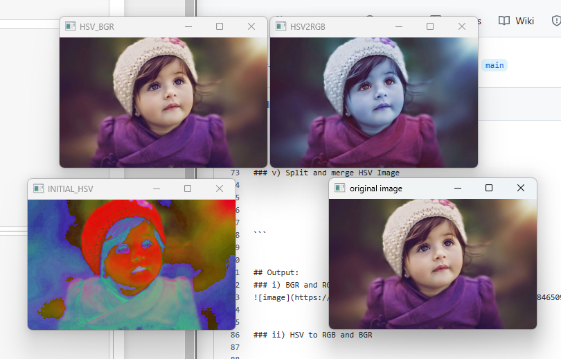
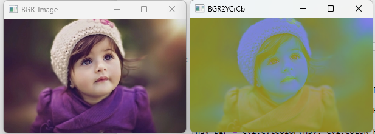
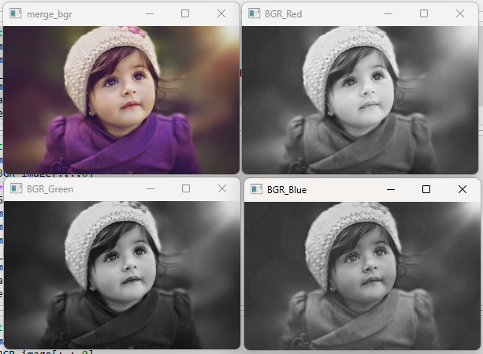
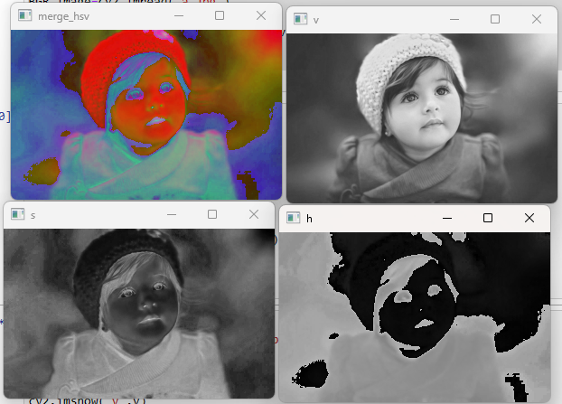

# Color Conversion
## AIM
To perform the color conversion between RGB, BGR, HSV, and YCbCr color models.

## Software Required:
Anaconda - Python 3.7
## Algorithm:
### Step1:
Import CV2 library.
### Step2:
Use cv2.cvtcolor() to convert colot in required image.
### Step3:
Use .imshow() to display and .imwrite() to save.
### Step4:
Use split() to disperse color into separate channels.
### Step5:
Use merge() to combine those separate channels into color.

## Program:
```
### Developed By: S.ABHISHEK
### Register Number: 212221230002
### i) Convert BGR and RGB to HSV and GRAY

import cv2
img = cv2.imread('a.jpg')
cv2.imshow('original image',img)
hsv_image = cv2.cvtColor(img,cv2.COLOR_BGR2HSV)
cv2.imshow('BGR2HSV',hsv_image)
hsv_image1 = cv2.cvtColor(img,cv2.COLOR_RGB2HSV)
cv2.imshow('RGB2HSV',hsv_image1)
gray_image = cv2.cvtColor(img,cv2.COLOR_BGR2GRAY)
cv2.imshow('BGR2GRAY',gray_image)
gray_image1 = cv2.cvtColor(img,cv2.COLOR_RGB2GRAY)
cv2.imshow('RGB2GRAY',gray_image1)
cv2.waitKey(0)
cv2.destroyAllWindows()


### ii)Convert HSV to RGB and BGR

import cv2
img1 = cv2.imread("a.jpg")
cv2.imshow('original image',img1)
hsv = cv2.cvtColor(img1 , cv2.COLOR_BGR2HSV)
cv2.imshow("INITIAL_HSV ", hsv)
hsv_rgb = cv2.cvtColor(hsv, cv2.COLOR_HSV2RGB)
cv2.imshow("HSV2RGB", hsv_rgb)
hsv_bgr = cv2.cvtColor(hsv, cv2.COLOR_HSV2BGR)
cv2.imshow("HSV_BGR", hsv_bgr)
cv2.waitKey(0)
cv2.destroyAllWindows()


### iii)Convert RGB and BGR to YCrCb
import cv2
BGR_image=cv2.imread('a.jpg')
cv2.imshow('BGR_Image',BGR_image)
YCrCb_image=cv2.cvtColor(BGR_image,cv2.COLOR_BGR2YCrCb)
cv2.imshow('BGR2YCrCb',YCrCb_image)
cv2.waitKey(0)
cv2.destroyAllWindows()


### iv)Split and Merge RGB Image
import cv2
BGR_image=cv2.imread('1.png')
blue=BGR_image[:,:,0]
green=BGR_image[:,:,1]
red=BGR_image[:,:,2]
cv2.imshow('BGR_Blue',blue)
cv2.imshow('BGR_Green',green)
cv2.imshow('BGR_Red',red)
merge_bgr=cv2.merge((blue,green,red))
cv2.imshow('merge_bgr',merge_bgr)
cv2.waitKey(0)
cv2.destroyAllWindows()


### v) Split and merge HSV Image
import cv2
house_color_image=cv2.imread('hsv.jpg')
h, s, v = cv2.split(hsv_image)
cv2.imshow('h',h)
cv2.imshow('s',s)
cv2.imshow('v',v)
merge_hsv=cv2.merge((h,s,v))
cv2.imshow('merge_hsv',merge_hsv)
cv2.waitKey(0)
cv2.destroyAllWindows()


```


## Output:
### i) BGR and RGB to HSV and GRAY


### ii) HSV to RGB and BGR



### iii) RGB and BGR to YCrCb



### iv) Split and merge RGB Image



### v) Split and merge HSV Image



## Result:
Thus the color conversion was performed between RGB, HSV and YCbCr color models.
